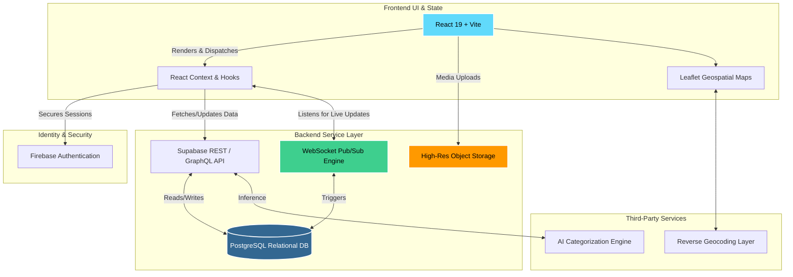

<div align="center">
  <!-- You can replace this with your actual logo -->
  <h1>🏛️ CivicTrack</h1>
  <p><em>Empowering Communities • Transforming Civic Issue Resolution</em></p>

  [](https://reactjs.org/)
  [](https://vitejs.dev/)
  [](https://tailwindcss.com/)
  [](https://supabase.com/)
  [](https://firebase.google.com/)
</div>

<hr />

## 🌟 Introduction

**CivicTrack** is a high-end, production-grade civic issue reporting platform built to bridge the gap between citizens and municipal authorities. 

By integrating modern technology like AI-based issue categorization, automated priority routing, and real-time geospatial tracking, CivicTrack ensures transparency, accountability, and accelerated resolution of public infrastructure issues (such as potholes, broken streetlights, or overfilled waste bins). 

Designed with a sleek, premium, **Linear-inspired UI/UX** (featuring dark modes, glassmorphism, and neon accents), the platform is not just functional but a joy to use, encouraging citizen engagement through gamification and intuitive design.

---

## 📸 Application Preview

### 🚀 Dashboard Overview


> Real-time overview of reported issues with status tracking, filtering, and community engagement.

---

### 📝 Report Issue (Real-Time GPS)


> Users can report issues with image, description, category, and precise GPS-based location for accurate reporting.

---

### 🛠️ Authority Panel – Issue Management (Kanban)


> Authorities manage issues using a Kanban workflow (Pending → In Progress → Resolved).

---

### 🗺️ Authority Panel – Live Issue Map


> Visual representation of issues on a live map for better decision-making and faster response.

---
### 🛠️ Authority Panel – Analytics 


> Authorities manage issues using a Analytics (Barchart and Piechart).

---
### 🛠️ User Profile View  


> User Profile with the issues and dashboard.

*(A look at the interactive dashboard where issues are tracked, managed, and gamified.)*

---

## ✨ Core Features

- **🤖 AI-Powered Smart Categorization:** Automatic prediction of issue category and priority based on the user's report description.
- **🗺️ Advanced Geospatial Mapping:** Precise GPS location services with reverse geocoding via Leaflet, visualizing nearby issues on an interactive map.
- **📊 Real-Time Interactive Kanban Dashboard:** For municipal authorities to track, prioritize, and manage ongoing civic issues efficiently.
- **🔔 Real-Time Notification System:** Live push-like updates sent to citizens on issue status changes, community comments, and platform mentions.
- **🛡️ Transparent Resolution Timeline:** Step-by-step audit trails linking community discussions with authority-uploaded verification proofs.
- **🎮 Gamification & Citizen Engagement:** Reputation points, badges, and an upvote system engineered to encourage active participation and crowdsourced validation.

---

## 🏗️ Detailed System Design & Architecture

CivicTrack is built on a modern **Serverless JAMstack architecture** designed for high availability, low latency, and absolute scalability.

### High-Level Architecture Flow



### Architectural Pillars

1. **Frontend Tier (Presentation & Interaction):** 
   - Built natively with **React 19** and bootstrapped via **Vite** for optimized Hot Module Replacement (HMR) and rapid builds.
   - Styled with **Tailwind CSS** focusing on a bespoke dark mode, custom utility classes (`tech-grid`, `glass-card`), and fluid animations for a stunning spatial interface.
   - State spans multiple modular contexts maintain strict boundaries between UI components and complex data logic.

2. **Backend & Database Tier (Supabase PostgreSQL):**
   - At the core lies a fully managed **PostgreSQL** database hosted on Supabase, structured in normalized schemas mapping Users, Issues, Comments, and Votes.
   - Security is uncompromising, utilizing **Row-Level Security (RLS)** strictly dictating data mutation rights depending on whether the actor is a standard citizen or a verified municipal administrator.
   
3. **Real-Time Data Pipeline:**
   - Issues, Comments, and Statuses are not polled. Instead, Supabase's Realtime WebSocket subscriptions push events instantly to the client. When an admin moves a KanBan card to "Resolved," the citizen's viewport is updated instantaneously without a refresh.

4. **Media Storage & Document Proofs:**
   - Supabase Object Storage manages high-resolution image uploads. Municipal authorities upload validation proofs (e.g., images showing a patched pothole), guaranteeing public transparency and undeniable proof of work.

---

## 🛠️ Technology Stack

| Domain | Technology | Significance |
| :--- | :--- | :--- |
| **Frontend UI Core** | React 19, Vite | Extremely fast virtual DOM rendering and modern build tooling |
| **Styling & Aesthetics** | Tailwind CSS, Radix UI | Granular utility styling for a bespoke, premium "Linear-style" design |
| **Database & API Layer** | Supabase (PostgreSQL) | Robust relational architecture with out-of-the-box RESTful endpoints |
| **Authentication System** | Firebase Auth / Supabase Auth | Highly secure, battle-tested standard email/password handling |
| **Realtime Pub/Sub Engine**| Supabase Realtime | Zero-latency, collaborative data streams across connected clients |
| **Geospatial & Cartography**| Leaflet, React Leaflet | Interactive, lightweight open-source geospatial visualization |

---

## 🚀 Getting Started Locally

Getting CivicTrack running on your local machine takes just a few steps.

### Prerequisites
- **Node.js** (v18 or higher)
- **npm** or **pnpm** package managers
- Accounts for Firebase and Supabase to retrieve configuration keys.

### Installation Guide

1. **Clone the repository:**
   ```bash
   git clone https://github.com/your-org/civictrack.git
   cd civictrack
   ```

2. **Install the dependencies:**
   ```bash
   npm install
   ```

3. **Configure Environment Variables:**
   Duplicate the provided example environment file and insert your service keys.
   ```bash
   cp .env.example .env
   ```

4. **Start the Development Server:**
   Launch the Vite development server to view the application.
   ```bash
   npm run dev
   ```
   *The application will boot concurrently at `http://localhost:5173`.*

---

## 🤝 Contribution & Governance

Because civic infrastructure belongs to everyone, this project actively welcomes contributors. Whether it is refining a micro-interaction in the UI, or fine-tuning the AI categorization heuristics, Pull Requests are appreciated!

<div align="center">
  <br/>
  <i>Built with ❤️ to transform how citizens engage with their communities.</i>
</div>
