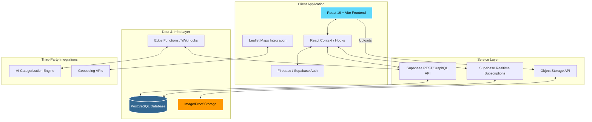

<div align="center">
  <!-- You can replace this with your actual logo -->
  <h1>🏛️ CivicTrack</h1>
  <p><em>Empowering Communities • Transforming Civic Issue Resolution</em></p>

  [](https://reactjs.org/)
  [](https://vitejs.dev/)
  [](https://tailwindcss.com/)
  [](https://supabase.com/)
  [](https://firebase.google.com/)
</div>

<hr />

## 🌟 Introduction

**CivicTrack** is a production-grade, highly scalable civic issue reporting platform. Designed with a premium, Linear-inspired UI/UX, it bridges the gap between citizens and municipal authorities. 

By integrating smart features like AI-based issue categorization, automated priority routing, and real-time geospatial tracking, CivicTrack ensures transparency, accountability, and accelerated resolution of public infrastructure issues. 

> **🎓 Note for the Jury:** This project represents a complete transformation from a basic reporting tool into a startup-ready SaaS product. It features a complete full-stack overhaul with engaging gamification and real-time community validation mechanics.

---

## ✨ Key Features

- **🤖 AI-Powered Smart Categorization:** Automatically predicts the category and priority of reported issues based on description patterns.
- **🗺️ Advanced Geospatial Mapping:** Precise GPS location services with reverse geocoding via Leaflet, visualizing issues on interactive map dashboards.
- **📊 Real-Time Analytics & Kanban Dashboard:** Authority dashboards with Kanban-style issue tracking and Recharts-powered analytics for municipal performance.
- **🔔 Real-Time Notification System:** Live updates on issue status changes, community comments, and platform mentions.
- **🛡️ Transparent Resolution Timeline:** Step-by-step audit trails linking community discussions with authority-uploaded verification proofs.
- **🎮 Gamification & Community Engagement:** Reputation points, badges, and an upvote system to encourage active citizen participation.

---

## 📸 Screenshots

*(For the Jury: Below are the core interface representations of the platform. You may insert project-specific screenshots here prior to final presentation.)*

<div align="center">
  
  
</div>
<br />
<div align="center">
  
  
</div>

---

## 🏗️ System Design & Architecture

CivicTrack uses a modern serverless JAMstack architecture to ensure high availability, fast asset delivery, and absolute scalability.



### Architecture Breakdown:
1. **Frontend Tier:** Built with React 19, styled using Tailwind CSS and Radix UI primitives for a sleek, accessible, and `framer-motion` animated interface.
2. **Backend & Database:** Supabase (PostgreSQL) handles relational data, stringent Row-Level Security (RLS) rules, and real-time database triggers.
3. **Storage Pipeline:** Scalable object storage handles high-resolution citizen uploads and authority-verified multimedia proofs securely.
4. **Third-Party Services:** Dedicated map services (Leaflet) handle local geographic awareness and location intelligence.

---

## 🛠️ Technology Stack

| Category | Technology | Purpose |
| :--- | :--- | :--- |
| **Frontend Framework** | React 19, Vite | Core UI rendering and highly optimized build tooling |
| **Styling & UI** | Tailwind CSS, Radix UI | Premium, accessible, Utility-first design system |
| **Animation** | Framer Motion | Fluid micro-interactions and route transitions |
| **Routing** | React Router DOM v7 | Application routing and layout management |
| **Database & Auth** | Supabase, Firebase | Primary data store, realtime sockets, secure authentication |
| **Maps & Geospatial** | Leaflet, React Leaflet | Interactive mapping and reverse geocoding |
| **Data Visualization**| Recharts | Dynamic analytics and reporting dashboards |

---

## 🚀 Getting Started

Follow these instructions to run CivicTrack locally.

### Prerequisites
- Node.js (v18+)
- npm or pnpm
- Supabase / Firebase project configurations (Keys available in `.env`)

### Installation

1. **Clone the repository**
   ```bash
   git clone https://github.com/your-org/civictrack.git
   cd civictrack
   ```

2. **Install dependencies**
   ```bash
   npm install
   ```

3. **Configure Environment Variables**
   Create a `.env` file referencing `.env.example` and add your database and API keys.
   ```bash
   cp .env.example .env
   ```

4. **Start the Development Server**
   ```bash
   npm run dev
   ```
   The application will be running at `http://localhost:5173`.

---

## 🎯 Jury Evaluation Guide

If you are evaluating this project, please focus on:
1. **The UX/UI Polish:** Experience the smooth transitions, informative empty states, and intuitive "Linear-inspired" issue reporting flow.
2. **Real-Time Data & Notification System:** Open the application in two separate windows to witness instantaneous updates when an issue status changes or a community comment is posted.
3. **Code Quality & Architecture:** Explore the `src/context/` boundary (e.g., `IssueContext.jsx`, `NotificationContext.jsx`) to see robust state management and service abstraction.
4. **Geospatial Integrity:** Test placing an issue exactly on the map coordinate and observe reverse geocoding functionality in action.

---
*Built with ❤️ for better, smarter, and transparent communities.*
